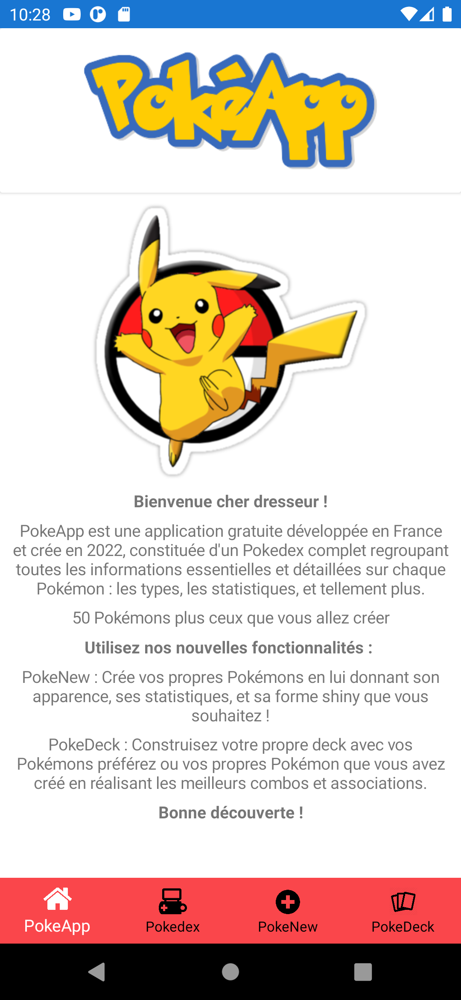
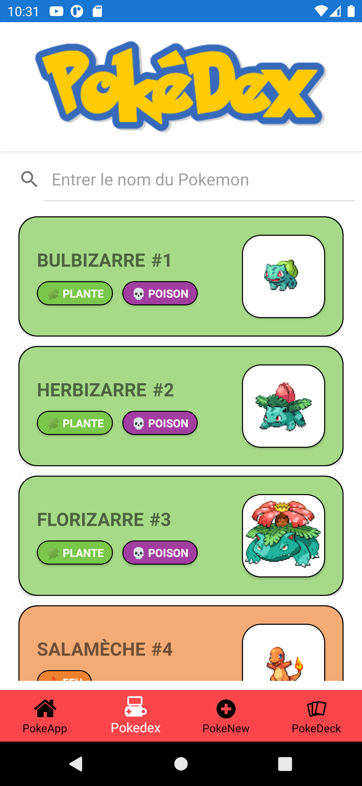
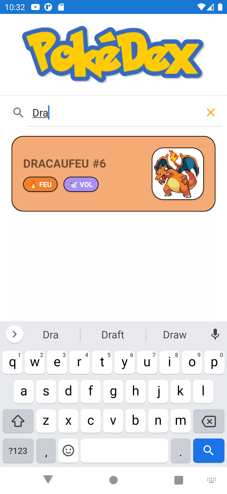
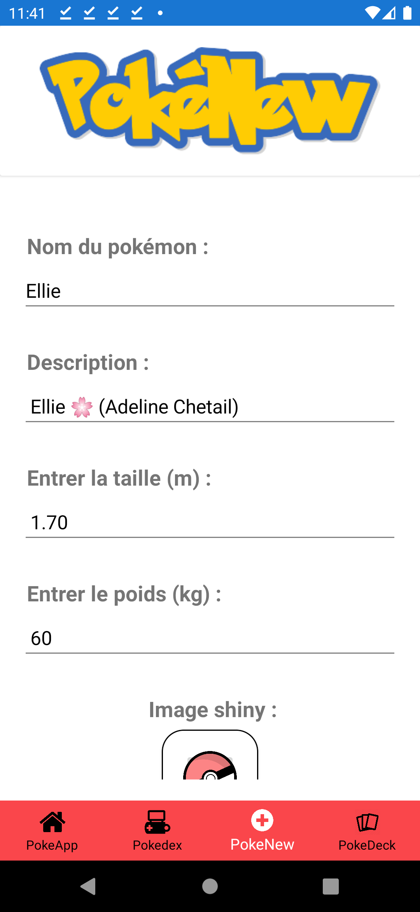
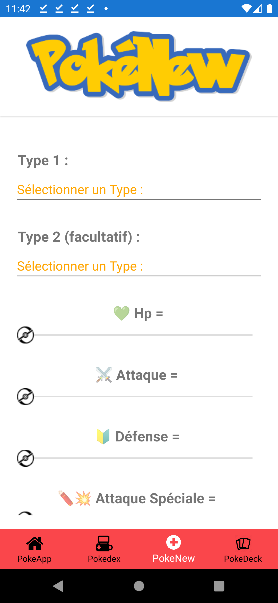
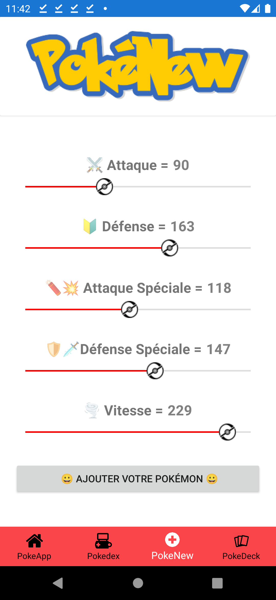

# PokéApp

PokéApp est une application mobile sur les Pokémons, reliée à une API (PokéApi) à l’aide de la 
technologie cross platform Xamarin Forms en respectant le pattern MVVM (Model – View – ViewModel).

***

# Présentation 

Cette application est composée d’un menu de quatre onglets : 

- **PokéApp :** Contient la page d’accueil de l'application.
- **Pokédex :** Contient une liste de 50 pokémons récupérées depuis l’API.
- **PokéNew :** Permet d’ajouter un pokémon en entrant ses diverses caractéristique.
- **PokéDeck :** Contient une liste des pokémons favories.

Si l’application est à sa première installation alors à son démarrage, elle va aller récupérer
50 pokémons dans l’API et les enregistrent en base de données. Par la suite tous les
pokémons ajoutés via « PokéNew » seront enregistrés en base de données.
Lors de la fermeture et la réouverture de l’application les 50 pokémons ainsi que les
pokémons ajoutés par l’utilisateur vont apparaître dans la « Pokédex ».

***

# Rendu visuel
## I- PokéApp
PokéApp contient la page d’accueil de l'application. Celle-ci possède un titre, un logo et une description :

## II- Pokédex
Pokédex contient une liste des 50 premiers pokémons récupérées depuis l’API. On affiche le nom du pokémon,
avec son image associée, ses différents types ainsi que son rang :

On peut également effectuer une recherche. On recherche ici le pokémon "Dracaufeu" :

Si on clique sur le pokémon, alors on a accès à sa page de détail contenant les diverses caractéristiques 
relatives au pokémon séléctioné : 

## III- PokéNew
PokéNew permet d’ajouter un pokémon en entrant ses diverses caractéristique. Dans un premier temps, on rentre
son image (pour cela , il suffit de cliquer sur la pokéball) : 

On accède ainsi à notre galerie photo : 

On sélectionne ensuite l'image souhaitée :

On obtient ensuite son rendu : 

Ensuite, on rempli les caractéristiques de notre pokémon à savoir son nom, sa description, 
sa taille et son poids : 

Puis, comme lors du premier ajout, on ajoute sa forme shiny (son évolution) : 

Ensuite, il nous faut sectionner son type. En effet, il existe 18 types de pokémons (Roche, Spectre,
Acier, Eau, Plante, Psy, Glace, Tenebre, Fée, Normal, Combat, Vol, Poison, Sol, Insecte, Feu, 
Electrik, Dragon). De plus un pokémon peut avoir jusqu'à deux types : 

Enfin on ajoute les statistiques (varie de 0 à 250) du pokémon à savoir sa vie, sa puissance d'attaque,
sa défense, la puissance de son attaque sépciale, sa défense spéciale et enfin sa vitesse : 

Si tous les champs ne sont pas remplis (à part le type2 qui est facultatif), alors un message d'erreur s'affiche :

Une fois les champs remplies, on ajoute le pokémon. Un pop-up de confirmation s'affiche alors :

On peut ensuite le visualiser à la fin de la liste dans le "Pokédex" : 

On peut également accèder à sa page de détail : 

 
## IV- PokéDeck

PokéDeck contient une liste des pokémons favories. Pour en ajouter un, il suffit de cocher le 
pokémon souhaité en consultant sa page de détail : 

Le pokémon s'est bien ajouté au PokéDeck :

